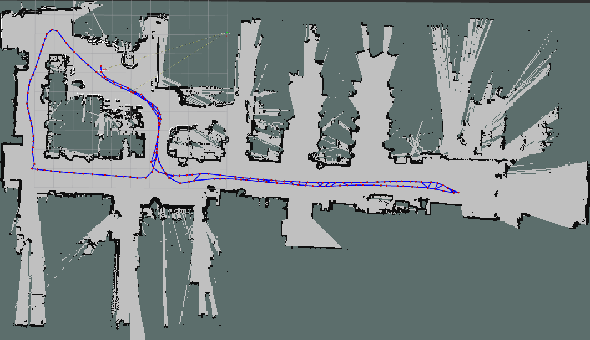
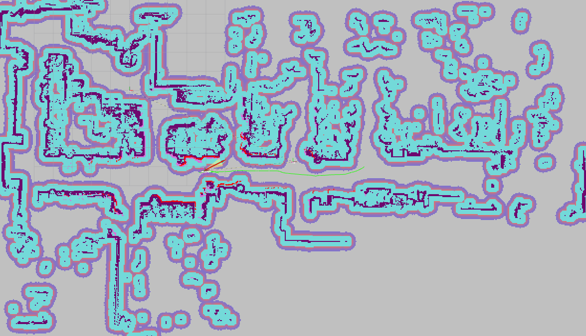
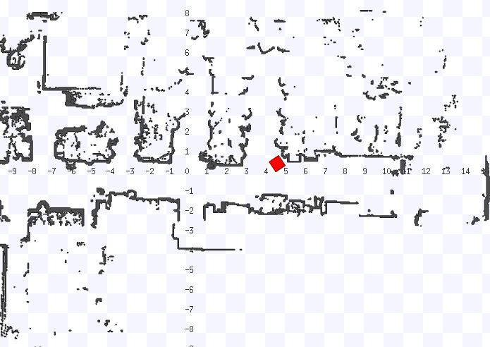

# Polimi Robotics Second Project

The goal of this group project is to, from a bag file, compute the a map of the environment, and then navigate the robot in the environment, using the map. The project is divided into two parts: the first part is to compute the map of the environment, and the second part is to navigate the robot in the environment.

## How to run the project

1. Start the docker container

2. Install the dependencies

```bash
apt install ros-humble-pointcloud-to-laserscan

apt install ros-humble-slam-toolbox

```

>    Note: to do this you need the root access, so you need to run the docker container with the command:
>   ```bash
>   sudo ./start_as_root.sh
>   ``` 

3. Build the workspace

```bash
colcon build 
source install/setup.bash
```

4. Run the launch files

The project is divided into two parts: the first focuses on mapping the environment using SLAM (Simultaneous Localization and Mapping), while the second focuses on navigating autonomously through the environment by following predefined goals. To run the first part, execute the following command:

```bash
ros2 launch second_project mapping_launch.py
```
And then run the bag file. Due to its size you need to manually download the bag file from the link provided in the project description

To run the second part, you need to run the following command:

```bash
ros2 launch second_project navigation_launch.py
```

## Result

Here are some screenshots of the result of the project:

### Mapping



### Navigation





## Roadmap 

- [x] Convert Point Cloud To Laser Scan
- [x] Fine tune the parameters of the node to get a good quality laser scan
- [x] Use the laser scan to compute the map of the environment
- [x] Fine tune the parameters of the parameters file to get a good map3
- [x] Use the map to navigate the robot in the environment
- [x] Add some noise to the robot odometry to simulate a real robot
- [x] Fine tune the parameters of the parameters file to get a good navigation performance
- [x] Write the publisher node that take a csv file with, the robot goes to the coordinate by avoiding the obstacles